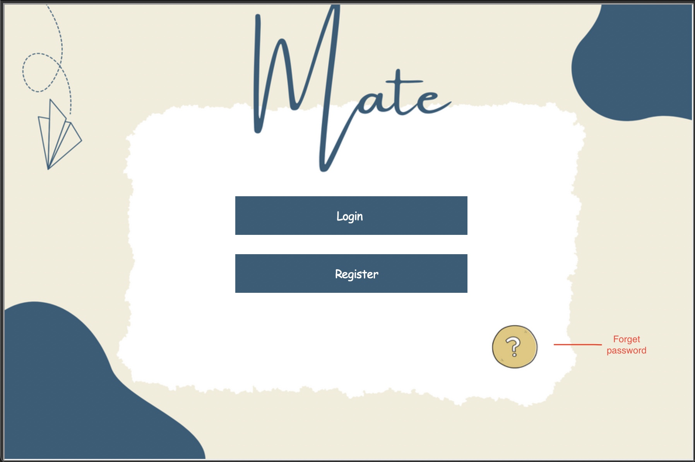

# **Mate**

This program is actually an academic project which is a part of the 01219114-65 Programming 1 course at Kasetsart University.

## What is Mate?

**_Mate_** is a program that will improve your life by performing useful tasks like checking the weather, delivering you the most recent information on 14 topics each day based on your interests, and more. Mate is your helper, friend, and family all at once. And Mate can help you out if you want to find out what music is popular right now by giving you a list of the top 10 songs according to a billboard. Last but not least, you may keep Mate updated on everything you accomplish by recording your diary with Mate. You can also create a to-do list, and Mate will alert you when a deadline is approaching.


## **Description**
### functional

- The program will be able to randomly generate a food's menu for the user.
- The program will be able to randomly generate a fortune-telling for the user.
- The program will be able to check the weather in the user's location.
- The program will be able to deliver the most recent information on 14 topics each day based on the user's interests.
- The program will be able to give the user a list of the top 10 songs according to a billboard.
- The program will be able to record the user's diary.
- The program will be able to create a to-do list.
- The program will be able to send an information's email to the user.

### Why Mate?
- I want to make a program that can solve a problem on a typical day such as a weather issue. 
- I want to make a program that can help people to be more productive and organized.


### Future plan
Since Mate is a program that is still in development, there are some features that I want to add to Mate in the future.
- Add a function that can send a notification to the user when a deadline is approaching.
- Since Mate is an assistant program, Mate needs to be more efficient to communicate with the user such as can add a function that uses any search engine API combine with speech recognition for better ability.


## How to run Mate?
Since some of Mate's functions couldn't be done by using just the python built-in modules, So there is some additional requirement for the user to run Mate.
### Requirement
- `Python` >= 3.7 w/ Tk/Tcl installed
- `Nominatim` (For find a location's latitude and longitude by using a location's name)
- `playsound` (For playing a sound effect)
- `requests` (For using API data)
- `BeautifulSoup` (For web scraping from bbc.com and billboard.com)
- `time` (For using time.sleep() function)
- `smtplib` (For sending an email to the user)

You can install dependencies by following command.
```bash
pip install -r requirements.txt
```

### Launch Instructions
Make sure you have all the required software installed.
```bash
~/ > git clone https://github.com/Jwizzed/Mate.git
~/ > cd Mate
 > python main.py
```

### How to use Mate?
- First, at the initial screen user will need to choose a login, register, or forget the password (the yellow circle) by clicking then the console will ask you for the information.



- After the user has already login to the program, The program will be no longer in the console anymore and have 5 buttons for the user to choose which are
  - **Interest**: In the interesting menu, There will have 4 buttons to choose from.
    - Eats: Give the user random food menu.
    - Song: Give the user the top 100 songs
    - News: Collect the user's interest ***for sending a mail.***
    - Fortune: Give the user random fortune telling.
  - **Weather**: To check the current weather.
  - **Note**: To write some things down the user must give both date and some text.
    - Add: To add a note.
    - Delete: To delete a note.
  - **Mail**: For choose what topics you want in a mail and send mail.
    - Change: To change/select the mail's topics.
    - Send mail: To send the mail to the user's mail.
  - **Delete** the account (The blue bin)

## Program Design

`Display` : This class is responsible for displaying the GUI of the program.

`Button` : This class is responsible for creating a button for Display class.

`Weather` : This class is for getting the weather data from the API.

`Note` : This class is designed for users who want to make notes or enter a to-do list with a deadline.

`Interest` : This class is designed to gather user interests and output information in line with their interests by web scraping the information from bbc.com and billboard.com.

`Mail` : This class is designed to send emails to users at their provided email addresses.

`Login` : This class is designed to allow users to log in to the program.


## Code Structure
[main.py](main.py) : The main file for executing the start of the program.

[mail.py](mail.py) : The file for sending an email to the user.

[display.py](display.py) : The file for displaying the GUI of the program.

[note.py](note.py) : The file for creating a note and a to-do list.

[interest.py](interest.py) : The file for getting the user's interest and output information in line with their interests.

[weather.py](weather.py) : The file for getting the weather data from the API.

[button.py](button.py) : The file for creating a button for Display class.

[login.py](login.py) : The file for allowing users to log in to the program.

[user.json](user.json) : The file for storing the user's information.

[background](background) : The folder for storing background image for the GUI.